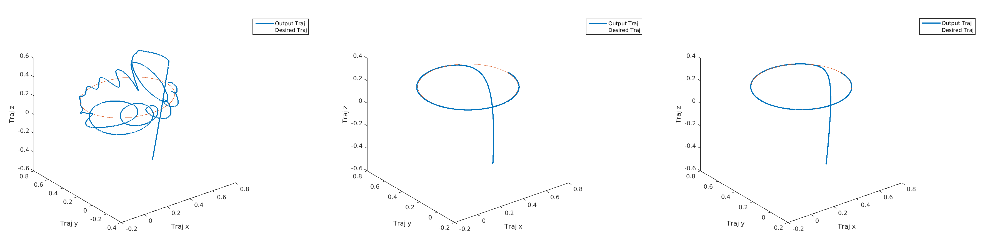
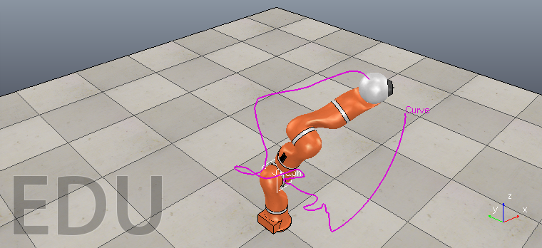
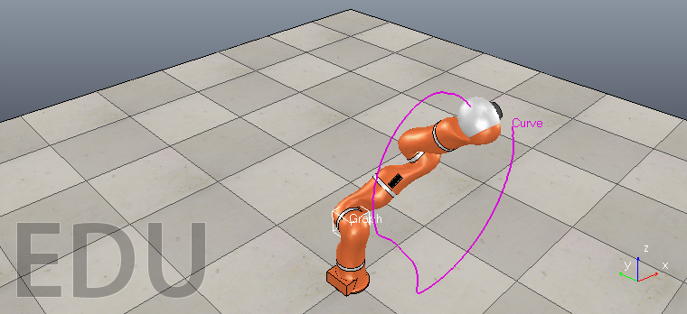
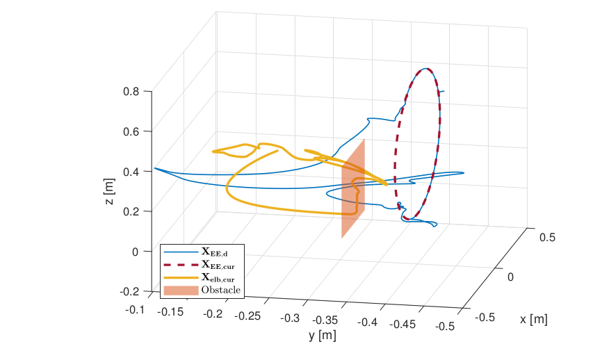
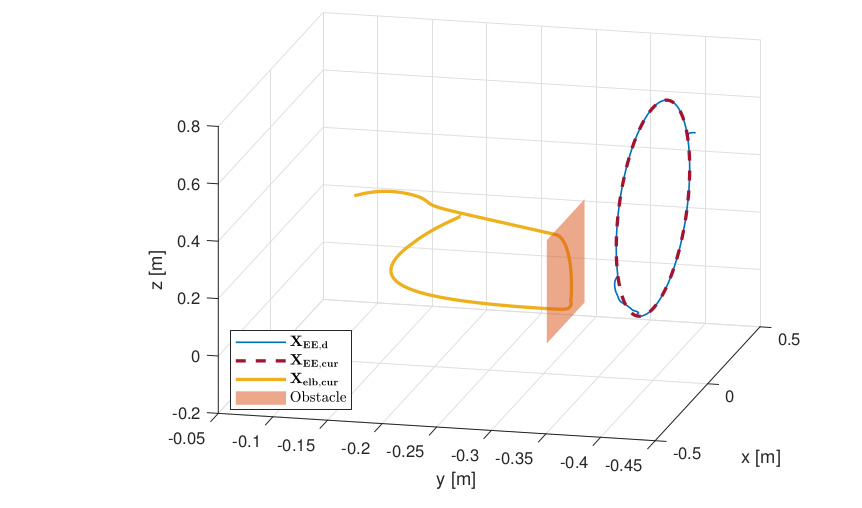

# Saturation_Joint_Cartesian_Space

**Implementing a simple Cartesian tracking controller**
Result of cartesian tracking control loop. (Not tunned(Left); Tracking output with duration T = 10(Center); Tracking output with duration T = 20(Right))

 
**Vrep result** of the Original algorithm (joint limit constraints having higher priority than Cartesian limit constraints)vs Proposed algorithm (no priority ordering of joint limit constraints and Cartesian limit constraints; all constraints assigned same priority) 
 
 
**Graphical result** of the Original algorithm vs Proposed algorithm
 